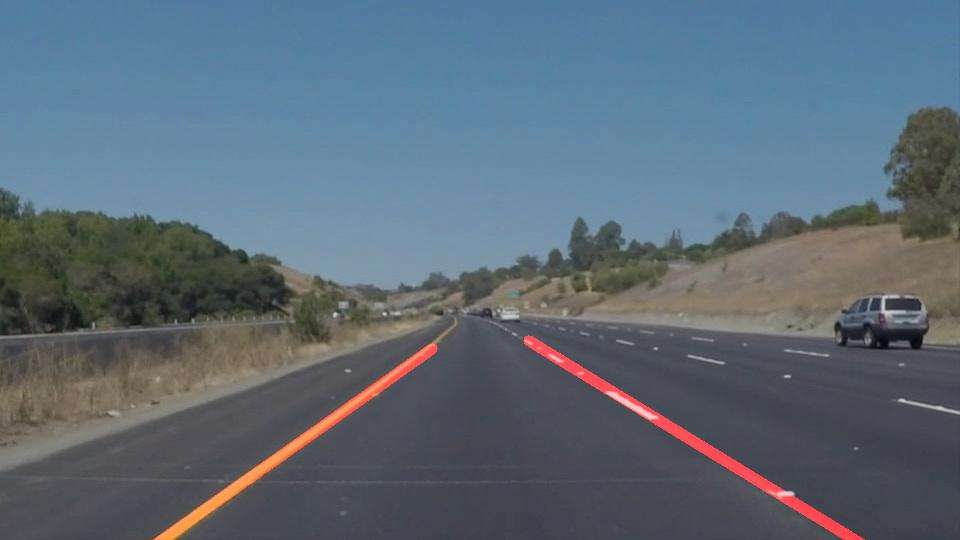

# **Finding Lane Lines on the Road** 

---


### Reflection

### 1. Describe your pipeline. As part of the description, explain how you modified the draw_lines() function.

My pipeline consisted of 5 steps. 

#### (1). Filter image through color space

I use HSV color space to find yellow color by using parameters :

```python
lower_yellow = np.array([20, 100, 100])
upper_yellow = np.array([30 ,255,255])
```
then use RGB color space to find white color by using parameters:

```python
lower_white = np.array([200,200,200])
upper_white = np.array([255,255,255])
```
#### (2)  Convert the images to gray scale

```python
gray = cv2.cvtColor(color_selected,cv2.COLOR_RGB2GRAY)
```
#### (3) Apply gaussian blur on gray scale image then do Canny edge detection

```python
kernel_size = 5
blur_gray = cv2.GaussianBlur(gray,(kernel_size, kernel_size),0)
```
#### (4) Do Hough transform and detect lane lines

```python
# Output "lines" is an array containing endpoints of detected line segments
lines = cv2.HoughLinesP(masked_edges, rho, theta, threshold, np.array([]),
                            min_line_length, max_line_gap)
```
#### (5)  Identify the full extent of the lane and marking it

 In order to extrapolate the line as a single lane line. Weighted average method was used. The average weight is the square of line length.

Here is how it works:




### 2. Identify potential shortcomings

Right dashed lane lines in one or two frames can not be detected. 


### 3. Suggest possible improvements to your pipeline

A possible improvement would be to have dynamic parameters for Canny, Hough functions according to the Image Histogram or Intensity average.
